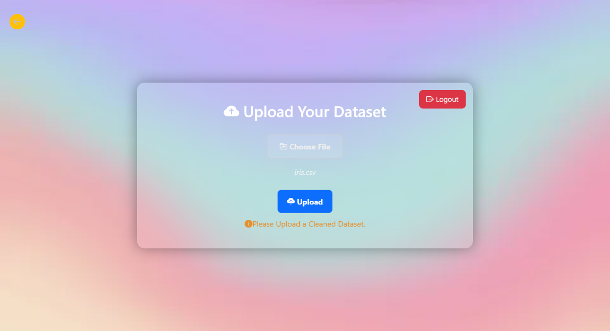
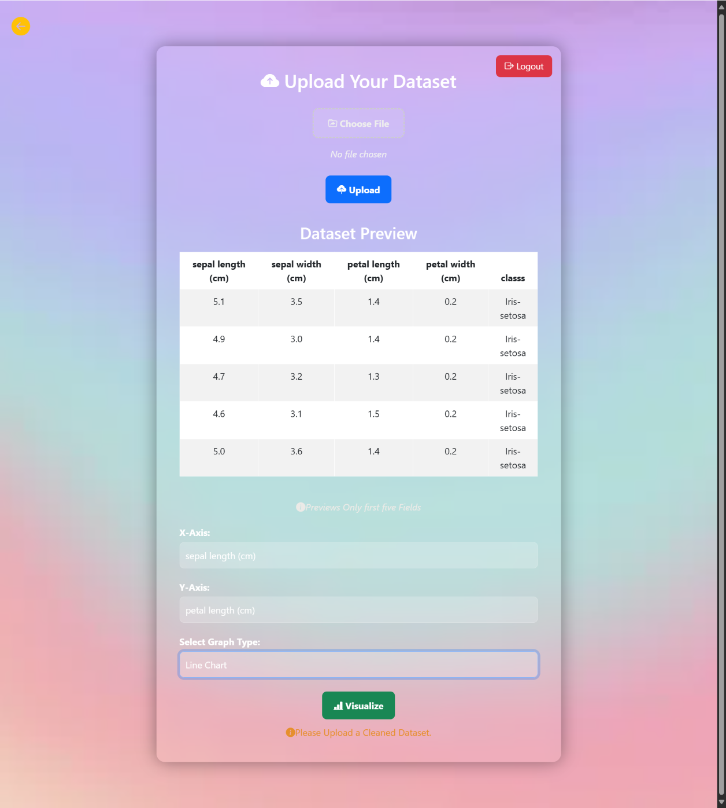
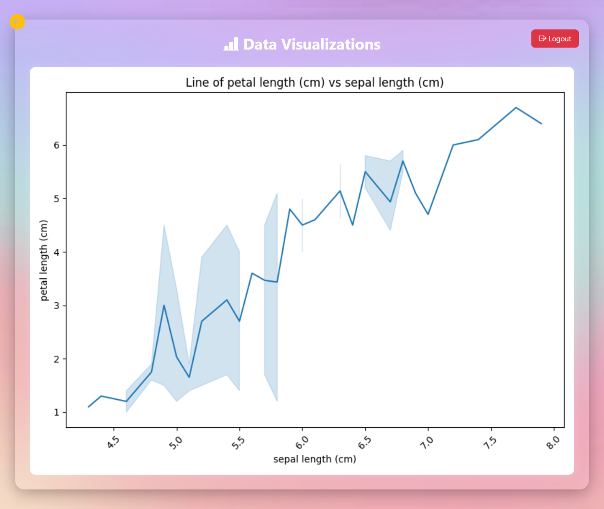

# 📊 Data Visualizer Tool

[](https://python.org)
[](https://www.djangoproject.com/)
[](https://mongodb.com)
[](https://getbootstrap.com)
[](LICENSE)

> A full-stack interactive data visualization tool built with Django and MongoDB. Upload CSV/XLSX files, preview data, select axis columns and chart types, and visualize them with beautiful graphs using Seaborn & Matplotlib.

---

## 🚀 Features

- 🔐 User Registration & Login System (Session-Based)
- 📁 Upload CSV / XLSX datasets
- 👁 Preview top 5 records from the dataset
- 📈 Choose X/Y columns and visualize:
  - Bar Graph
  - Line Chart
  - Pie Chart
  - Scatter Plot
- ⚙️ K-Means + Representative Sampling for large datasets (limited to 50 points)
- 🎨 Modern UI with Bootstrap 5 + Custom CSS
- 🧹 Browser Back Button Restriction for Navigation Security
- 📦 Media storage for uploaded files and graph images
- ✅ Logout and session management

---

## 🛠 Tech Stack

| Layer        | Tech                                    |
| ------------ | ---------------------------------------- |
| Frontend     | HTML5, CSS3, Bootstrap 5, JavaScript     |
| Backend      | Python, Django                           |
| Database     | MongoDB (via PyMongo)                    |
| Data Tools   | Pandas, Seaborn, Matplotlib, Scikit-learn|
| Hosting      | Compatible with Render, Railway, Heroku  |

---

## 🔧 Installation (Local)


# 1. Clone the repo
```bash
git clone https://github.com/sachin-bharadvaj/Data-visualizer-tool.git
cd Data-visualizer-tool
```

# 2. Create virtual environment
```bash
python -m venv env
source env/bin/activate  # On Windows: env\Scripts\activate
```

# 3. Install dependencies
```bash
pip install -r requirements.txt
```

# 4. Run server
```bash
python app.py runserver
```
## 🖼️ Preview Screenshots

Take a quick look at the interface and features of the **Data Visualizer Tool**:

<p align="center">
  <br>
  <br>
  
</p>

## 👨‍💻 Author
**Sachin Bharadvaj**  

